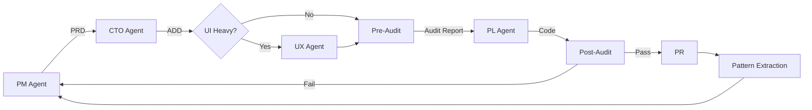

# The Orchestrator

An autonomous orchestration framework for [Claude Code](https://docs.anthropic.com/en/docs/claude-code). Plans sprints from outcomes, executes them with quality gates, and ships code — using the AI-Human Engineering Stack.

The Orchestrator turns a set of project outcomes into shipped code through an autonomous agent cycle: a Product Manager agent plans sprints, a CTO agent makes architecture decisions, a Project Lead agent executes with wave-based parallelism, and dual reliability + security audits verify everything before a PR is created. Cross-run learning means every sprint builds on what the system learned from previous ones.

## Architecture



## Prerequisites

- [Claude Code CLI](https://docs.anthropic.com/en/docs/claude-code) installed and authenticated
- Git
- A project repository you want to orchestrate

## Quick Start

```bash
# 1. Clone The Orchestrator
git clone https://github.com/growthmind-inc/the-orchestrator.git

# 2. Copy into your project
cp -r the-orchestrator/.claude/ /path/to/your-project/.claude/
cp -r the-orchestrator/shared/ /path/to/your-project/shared/
mkdir -p /path/to/your-project/.ai/

# 3. Customize CLAUDE.md for your project
cp the-orchestrator/CLAUDE.md /path/to/your-project/CLAUDE.md
# Edit CLAUDE.md to reflect your tech stack and conventions

# 4. Discover your values (interactive session)
cd /path/to/your-project
claude "/values-discovery"

# 5. Define outcomes
claude "/outcomes"

# 6. Launch the orchestrator
claude "/orchestrate"
```

See `docs/QUICK_START.md` for a detailed setup guide.

## Skills

| Skill | Description | When to Use |
|-------|-------------|-------------|
| `/orchestrate` | Autonomous Product Manager to Project Lead cycle | Full sprint automation |
| `/outcomes` | Define project outcomes | Project setup |
| `/prd` | Generate Product Requirements Document | Complex features needing full spec |
| `/architect` | Design architecture from PRD | Architecture decisions |
| `/taskgen` | Generate task list from PRD | Task decomposition |
| `/execute` | Wave-based task execution | Sprint implementation |
| `/reliability-audit` | Failure analysis and test gap discovery | Before/after implementation |
| `/code-quality-review` | Code change quality review | Before commits |
| `/commit` | Conventional commit | Simple commits |
| `/ship` | Branch, commit, push, PR | Full git workflow |
| `/validate` | Build, runtime, integration validation | Pre-deploy checks |
| `/values-discovery` | Discover engineering values | Project setup |
| `/drift-report` | Weekly code quality patterns | Maintenance |
| `/update` | Auto-update memory files | After code changes |
| `/delta` | Minimum variance analysis | Before building |
| `/investigate` | Feasibility research | Exploring ideas |
| `/feature` | AI-optimized feature implementation | Building features |
| `/bugs` | Bug exploration and fix planning | Debugging |

## The AI-Human Engineering Stack

The Orchestrator is built on a six-layer framework for effective AI agent workflows:

| Layer | Purpose | Implementation |
|-------|---------|---------------|
| **Prompt Engineering** | What to do | Skill files (`.claude/skills/`) |
| **Context Engineering** | What to know | `CLAUDE.md`, `.claude/rules/`, `VALUES.md` |
| **Intent Engineering** | What to want | `shared/OUTCOMES.md`, PRDs, north star statements |
| **Judgment Engineering** | What to doubt | Decision heuristics, `--review` flag, feasibility spikes |
| **Coherence Engineering** | What to become | Sprint retros, pattern extraction, identity persistence |
| **Evaluation Engineering** | How to know | Audits, code review, validation gates |

_The AI-Human Engineering Stack framework was created by Henrique Sanchez and Hayen Mill._

## How It Works

### The Cycle

1. **Product Manager Agent** reads outcomes + values + past retros, plans a sprint, writes a PRD
2. **CTO Agent** reads the PRD + codebase patterns, makes architecture decisions, writes an ADD
3. **UX Agent** (optional) designs the user experience for UI-heavy sprints
4. **Pre-Audit** identifies likely failures and test specs before coding begins
5. **Project Lead Agent** generates tasks, executes them in parallel waves, validates, commits
6. **Post-Audit** verifies reliability and security of the implementation
7. **Pattern Extraction** captures learnings for future sprints
8. **PR** — changes land on a feature branch for human review

### Cross-Run Learning

Every sprint produces a retrospective at `.ai/retros/`. After every 3rd retro, the system extracts recurring patterns into `.ai/patterns.md`. Future agents read these patterns, creating a learning loop that improves sprint quality over time.

### Quality Gates

- Pre-implementation reliability audit
- Per-wave validation (typecheck + lint)
- Post-execution code review
- Post-sprint reliability audit
- Post-sprint security audit
- Refactor and regression scan

## Project Structure

```
your-project/
  CLAUDE.md                    # Project-specific agent context
  .claude/
    skills/                    # Slash command definitions
    rules/                     # Path-triggered convention rules
    VALUES.md                  # Your identity and decision heuristics
    SKILLS_GUIDE.md            # Skill selection decision tree
  .ai/
    CONTEXT.md                 # Project overview
    retros/                    # Sprint retrospectives
    audits/                    # Audit reports
    patterns.md                # Cross-run learnings
  shared/
    OUTCOMES.md                # Project outcomes
    ROADMAP.md                 # Sprint progress
```

## Customization

### Validation Commands

Skill files use `[your validation command]` as placeholders. Replace with your project's commands:

```bash
# TypeScript project
[your validation command] -> npx tsc --noEmit && npx eslint . --quiet

# Python project
[your validation command] -> mypy . && ruff check .

# Rust project
[your validation command] -> cargo check && cargo clippy
```

### Agent Types

Agent roles (like `execution-agent`, `research-agent`, `reliability-auditor`) are defined inline via Task tool prompts. There is no separate config file. Create your own agent definition files if you want persistent agent personas.

## Attribution

- **The AI-Human Engineering Stack** framework by Henrique Sanchez and Hayen Mill
- **The Orchestrator** — built in production, open-sourced for the community
- Read the full deep-dive: [We Open-Sourced Our AI Agent Orchestrator](https://devdecks.ai/blog/open-source-orchestrator-ai-agents) (blog post)

## License

MIT
