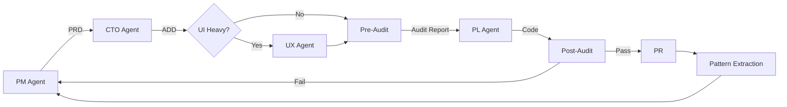

# Architecture: The AI-Human Engineering Stack

The Orchestrator is built on the **AI-Human Engineering Stack** — a layered framework of intelligence for effective LLM and agentic workflows.

_Attribution: The AI-Human Engineering Stack framework was created by Henrique Sanchez and Hayen Mill (March 2026)._

## The Six Layers

```
                                +----------+
                                |  FINAL   |
                                |  OUTPUT  |
                                +----+-----+
      Eval runs                      |               HARNESS ENGINEERING
      through --+                    |              (Where and how to do)
      harness   |                    |                       |
                v                    |                       |
    +---------------+---------------+--------------+        |
    |               |  COHERENCE ENGINEERING       |<-------|
    |               |  (What to become while doing)|        |
    |  E            +------------------------------+        |
    |  V            |  JUDGMENT ENGINEERING         |<-------|
    |  A            |  (What to doubt while doing)  |        |
    |  L            +------------------------------+        |
    |  U            |  INTENT ENGINEERING           |<-------|
    |  A            |  (What to want while doing)   |        |  Each layer
    |  T            +------------------------------+        |  depends on
    |  I            |  CONTEXT ENGINEERING          |<-------|  all layers
    |  O            |  (What to know while doing)   |        |  beneath it
    |  N            +------------------------------+        |
    |               |  PROMPT ENGINEERING           |<-------+
    |  (How to know |  (What to do)                 |
    |  while doing) |                               |  User sets up the
    +---------------+-----------+-------------------+  harness initially
                                |                      and may intervene
      +------+                  |                      as needed
      | USER |------------------+
      +------+    User begins        User re-enters
                  with the prompt    each layer if needed
                                     depending on evaluation
```

### Layer 1: Prompt Engineering — "What to do"

The foundation. Skill files (`.claude/skills/*/SKILL.md`) define what each agent does. Each slash command is a prompt that instructs the agent on its task, process, and output format.

**In The Orchestrator:** Skills like `/prd`, `/architect`, `/taskgen`, and `/execute` are prompt engineering artifacts. They tell the agent exactly what to produce.

### Layer 2: Context Engineering — "What to know while doing"

What the agent knows while executing. `CLAUDE.md`, `.claude/rules/`, and `.claude/VALUES.md` provide persistent context that shapes every decision.

**In The Orchestrator:** The `CLAUDE.md` file provides project-wide context. Rules auto-load based on file paths. `VALUES.md` provides personalized decision heuristics.

### Layer 3: Intent Engineering — "What to want while doing"

What the agent is trying to achieve. `shared/OUTCOMES.md` and PRDs define the goals. Every task prompt includes a "north star" statement.

**In The Orchestrator:** The PM agent reads outcomes and converts them into sprint PRDs with explicit north star statements. Every execution agent receives the north star in its prompt.

### Layer 4: Judgment Engineering — "What to doubt while doing"

What the agent should question. Decision heuristics in `VALUES.md`, feasibility spikes, and the `--review` checkpoint all enable human judgment at key moments.

**In The Orchestrator:** The PM agent runs decisions through value heuristics before committing. The `--review` flag pauses for human sign-off. Feasibility spikes run for high-risk sprints.

### Layer 5: Coherence Engineering — "What to become while doing"

Identity and consistency across runs. Sprint retrospectives, pattern extraction, and the learning system ensure agents don't repeat mistakes and maintain architectural coherence.

**In The Orchestrator:** `.ai/retros/` captures per-sprint learnings. `.ai/patterns.md` distills recurring patterns. Every PM and CTO agent reads past retros before planning.

### Layer 6: Evaluation Engineering — "How to know while doing"

The feedback loop. Code quality reviews, reliability audits, security audits, and validation gates evaluate every output.

**In The Orchestrator:** Dual reliability audits (pre + post implementation), security audits, code quality reviews, and `[your validation command]` checks run on every sprint.

## The Orchestrator Cycle



### Cycle Steps

1. **PM Agent** reads outcomes, values, and past retros. Plans a sprint. Writes a PRD.
2. **CTO Agent** reads the PRD and codebase patterns. Makes architecture decisions. Writes an ADD.
3. **UX Agent** (optional, for UI-heavy sprints) designs the user experience. Writes a UX spec.
4. **Pre-Implementation Audit** identifies likely failures and generates test specs before coding.
5. **PL Agent** executes the sprint: generates tasks, runs them in parallel waves, validates, commits.
6. **Post-Sprint Audits** (reliability + security) verify the implementation.
7. **Pattern Extraction** captures learnings from every 3rd sprint retro.
8. **PR Creation** — changes land on a feature branch with a draft PR for human review.

### Agent Types

The orchestrator uses these agent roles, defined inline via Task tool prompts:

| Agent Type | Role | When Used |
|-----------|------|-----------|
| `research-agent` | Explores codebase for context | PRD generation, investigation |
| `prd-writer` | Generates PRD documents | Sprint planning |
| `execution-agent` | Implements code changes | Task execution |
| `code-review` | Reviews code quality | Post-execution |
| `reliability-auditor` | Identifies failures and test gaps | Pre/post implementation |
| `security-auditor` | Checks auth, validation, data exposure | Post-implementation |
| `build-validator` | Validates build and compilation | Validation pipeline |
| `dev-server-monitor` | Monitors runtime errors | Validation pipeline |
| `integration-tester` | Tests API routes and flows | Validation pipeline |

These are not separate config files — the agent's role is defined in the Task tool prompt. The `subagent_type` field is a descriptive label.

## Key Design Decisions

### One Branch Per Objective, One Commit Per Sprint

Sprint branches stack on objective-level branches. Each sprint produces one clean commit. PRs are created for human review — the orchestrator never merges directly to main.

### Wave-Based Parallelism

Tasks within a sprint are grouped into waves based on file conflicts. Non-conflicting tasks run in parallel. Dependencies are respected via wave ordering.

### Cross-Run Learning

Sprint retrospectives capture what worked and what broke. After every 3rd retro, pattern extraction distills recurring lessons into `.ai/patterns.md`. Future PM and CTO agents read these patterns, creating a learning system that improves over time.

### Quality Gates

Every sprint passes through multiple quality gates:
- Pre-implementation reliability audit
- Per-wave typecheck and lint validation
- Post-execution code review
- Post-sprint reliability audit
- Post-sprint security audit
- Refactor and regression scan

Only sprints that pass all gates produce a PR.
